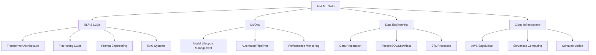

  

# 👋 Hello, AI World! 

  

## 🧠 About Me

I'm a Systems & Industrial Engineer specialized in **Artificial Intelligence** and **Machine Learning** with a focus on **Natural Language Processing** and **Large Language Models**. Currently pursuing a Master's in Systems Engineering to deepen my expertise in AI.

- 🔭 Currently building advanced **RAG architectures** and fine-tuning LLMs
- 🌱 Learning advanced **prompt engineering** techniques and LLM optimization
- 🚀 Experienced in deploying AI solutions on AWS (SageMaker, Lambda, S3)
- 🔍 Passionate about bridging the gap between ML research and real-world applications

 

## 🛠️ Tech Stack

  
### Core AI/ML

### NLP & LLMs

### Cloud & MLOps

### Programming

## 🚀 Featured Projects

<table>
  <tr>
    <td width="50%">
      <h3 align="center">🔍 Advanced RAG Architecture</h3>
      

        
<b>Tech:</b> AWS SageMaker, BERT Embeddings, LlamaIndex, PostgreSQL

        
Developed a sophisticated RAG architecture with contextual BERT embeddings and fine-tuned Llama models, enabling efficient knowledge retrieval from large document collections. Implemented vector database optimization and hybrid search methods.

      

    </td>
    <td width="50%">
      <h3 align="center">🤖 Text Classification with Fine-Tuned Models</h3>
      

        
<b>Tech:</b> PyTorch, Transformers, HuggingFace, AWS EC2

        
Created a custom fine-tuning pipeline for transformer models to classify domain-specific documents. Implemented data augmentation techniques and attention mechanisms to improve performance on limited training data. 

      

    </td>
  </tr>
  <tr>
    <td width="50%">
      <h3 align="center">🧠 LLM-Based Document Classification System</h3>
      

        
<b>Tech:</b> Langchain, OpenAI API, Chroma DB, FastAPI

        
Built an intelligent document classification system using Langchain and LLMs. Designed custom prompt templates and few-shot examples to guide model behavior. Implemented document chunking strategies and embedding pipelines, with in-context learning for continuous improvement.

      

    </td>
    <td width="50%">
      <h3 align="center">🎮 Reinforcement Learning for MILP Optimization</h3>
      

        
<b>Tech:</b> Python, TensorFlow, Gurobi, Operations Research

        
Developed a hybrid reinforcement learning approach to solve complex Mixed Integer Linear Programming problems. <a href="https://github.com/Tomas1307/Reinforcement_learning_milp_heuristic" target="_blank">Public repository</a> shows how RL agents can learn heuristics to accelerate commercial solvers, reducing solution time by 65% on large-scale logistics optimization problems.

      

    </td>
  </tr>
</table>

## 📊 AI Skills Matrix

## 📈 GitHub Stats & Activity

  

  

## 🎓 Certifications & Education

- **Master's in Systems Engineering** - Universidad de Los Andes (2024-2026)
- **Systems Engineering** - Universidad de Los Andes (2020-2024)
- **Industrial Engineering** - Universidad de Los Andes (2021-2025)
- **Building LLM Applications With Prompt Engineering** - NVIDIA (2025)
- **Building Transformer-Based NLP Applications** - NVIDIA (2024)
- **Fundamentals of Deep Learning** - NVIDIA (2025)

## 🔗 Let's Connect

  
  

---

  

